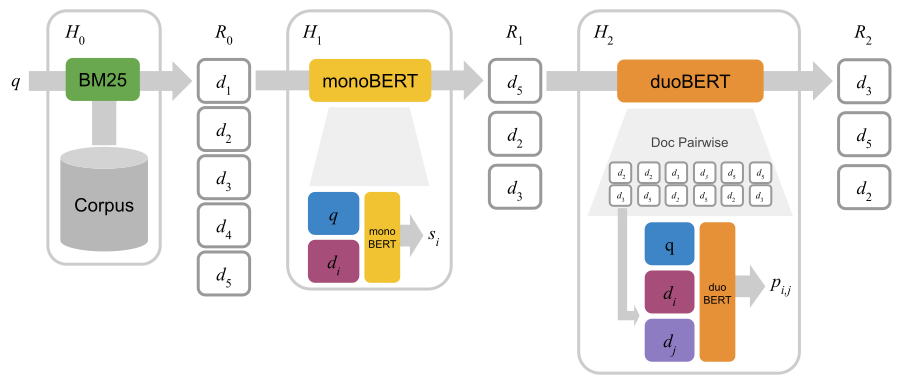

# duoBERT

duoBERT is a pairwise ranking model based on BERT that is the last stage of a multi-stage retrieval pipeline:



To train and re-rank with monoBERT, please check [this repository](https://github.com/nyu-dl/dl4marco-bert).

As of Jan 13th 2020, our MS MARCO leaderboard entry is the top scoring model with available code:

MSMARCO Passage Re-Ranking Leaderboard (Jan 13th 2020) | Eval MRR@10  | Dev MRR@10
------------------------------------- | :------: | :------:
SOTA - Enriched BERT base + AOA index + CAS | 0.393 | 0.408
BM25 + monoBERT + duoBERT + TCP (this code) | 0.379 | 0.390


For more details, check out our paper:
- R Nogueira, W Yang, K Cho, J Lin. [Multi-stage document ranking with BERT](https://arxiv.org/pdf/1910.14424.pdf).


## Data and Trained Models

We make the following data available for download:

+ `bert-large-msmarco-pretrained_only.zip`: monoBERT large pretrained on the MS MARCO corpus but not finetuned on the ranking task. We pretrained this model starting from the original BERT-large WWM (Whole Word Mask) checkpoint. It was pretrained for 100k iterations, batch size 128, learning rate 3e-6, and 10k warmup steps. We finetuned monoBERT and duoBERT from this checkpoint.
+ `monobert-large-msmarco-pretrained-and-finetuned.zip`: monoBERT large pretrained on the MS MARCO corpus and finetuned on the MS MARCO ranking task.
+ `duobert-large-msmarco-pretrained-and-finetuned.zip`: duoBERT large pretrained on the MS MARCO corpus and finetuned on the MS MARCO ranking task.
+ `run.monobert.dev.small.tsv`:  Approximately 6,980,000 pairs of dev set queries and retrieved passages using BM25 and re-ranked with monoBERT. In this tsv file, the first column is the query id, the second column is the passage id, and the third column is the rank of the passage. There are 1000 passages per query in this file.
+ `run.monobert.test.small.tsv`:  Approximately 6,837,000 pairs of test set queries and retrieved passages using BM25 and re-ranked with monoBERT.
+ `run.duobert.dev.small.tsv`:  Approximately 6,980 x 30 pairs of dev set queries and passages re-ranked using duoBERT. In this run, the input to duoBERT were the top-30 passages re-ranked by monoBERT.
+ `run.duobert.test.tsv`:  Approximately 6,837 x 30 pairs of test set queries and passages re-ranked using duoBERT. In this run, the input to duoBERT were the top-30 passages re-ranked by monoBERT.
+ `dataset_train.tf`:  Approximately 40M pairs of training set queries and passages (relevant and non-relevant) in the TF Record format.
+ `dataset_dev.tf`:  Approximately 6,980 x 30 pairs of dev set queries and passages in the TF Record format. These top-30 passages will be re-ranked by duoBERT.
+ `dataset_test.tf`:  Approximately 6,837 x 30 pairs of test set queries and passages in the TF Record format. These top-30 passages will be re-ranked by duoBERT.
+ `query_doc_ids_dev.txt`:  Approximately 6,980 x 30 pairs of query and doc id that will be used during inference.
+ `query_doc_ids_test.txt`:  Approximately 6,837 x 30 pairs of query and doc id that will be used during inference.
+ `queries.dev.small.tsv`: 6,980 queries from the MS MARCO dev set. In this tsv file, the first column is the query id, and the second is the query text.
+ `queries.eval.small.tsv`: 6,837 queries from the MS MARCO test (eval) set. In this tsv file, the first column is the query id, and the second is the query text.
+ `qrels.dev.small.tsv`: 7,437 pairs of query relevant passage ids from the MS MARCO dev set. In this tsv file, the first column is the query id, and the third column is the passage id. The other two columns (second and fourth) are not used.
+ `collection.tar.gz`: All passages (8,841,823) in the MS MARCO passage corpus. In this tsv file, the first column is the passage id, and the second is the passage text.
+ `triples.train.small.tar.gz`: Approximatelly 40M triples of query, relevant and non-relevant passages that are used to train duoBERT.

Download and verify the above files from the below table:

File | Size | MD5 | Download
:----|-----:|:----|:-----
`bert-large-msmarco-pretrained-only.zip` |  3.44 GB | `4ffd0bc14221aa209b7e2af0ea54bac0` | [[GCS](https://storage.googleapis.com/duobert_git/bert-large-msmarco-pretrained-only.zip)] [[Dropbox]()]
`monobert-large-msmarco-pretrained-and-finetuned.zip` | 3.42 GB | `db201b6433b3e605201746bda6b7723b` | [[GCS](https://storage.googleapis.com/duobert_git/monobert-large-msmarco-pretrained-and-finetuned.zip)] [[Dropbox]()]
`duobert-large-msmarco-pretrained-and-finetuned.zip` | 3.43 GB | `5b7c64cbfd34d3782f74fd01b3380a23` | [[GCS](https://storage.googleapis.com/duobert_git/duobert-large-msmarco-pretrained-and-finetuned.zip)] [[Dropbox]()]
`run.monobert.dev.small.tsv` | 127 MB | `63d0a07832d91d1e6ece5c867d346be7` | [[GCS](https://storage.googleapis.com/duobert_git/run.monobert.dev.small.tsv)] [[Dropbox]()]
`run.monobert.test.small.tsv` | 125 MB | `3dcb15d93f1fe1943d7fac3f72961784` | [[GCS](https://storage.googleapis.com/duobert_git/run.monobert.test.small.tsv)] [[Dropbox]()]
`run.duobert.dev.small.tsv` | 6 MB | `dce7f9fe8c1a844c6075b470530ec91e` | [[GCS](https://storage.googleapis.com/duobert_git/run.duobert.dev.small.tsv)] [[Dropbox]()]
`run.duobert.test.small.tsv` | 6 MB | `6feab65866db449057e588c8c33db0de` | [[GCS](https://storage.googleapis.com/duobert_git/run.duobert.test.small.tsv)] [[Dropbox]()]
`dataset_train.tf` |  GB | `` | [[GCS](https://storage.googleapis.com/duobert_git/dataset_train.tf)] [[Dropbox]()]
`dataset_dev.tf` | 3.4 GB | `596f016c5d9c789c667aa5112194caed` | [[GCS](https://storage.googleapis.com/duobert_git/dataset_dev.tf)] [[Dropbox]()]
`dataset_test.tf` | 3.4 GB | `cc59c0c8f77f376ba7b487dec5a1f376` | [[GCS](https://storage.googleapis.com/duobert_git/dataset_test.tf)] [[Dropbox]()]
`query_doc_ids_dev.txt` | 134 M | `0b1ef659127339f71e70da28d63e513c` | [[GCS](https://storage.googleapis.com/duobert_git/query_doc_ids_dev.txt)] [[Dropbox]()]
`query_doc_ids_test.txt` | 131 M | `a857664b0cb47219266a6edeb7eb4b6c` | [[GCS](https://storage.googleapis.com/duobert_git/query_doc_ids_test.txt)] [[Dropbox]()]
`queries.dev.small.tsv` | 283 KB | `41e980d881317a4a323129d482e9f5e5` | [[GCS](https://storage.googleapis.com/duobert_git/queries.dev.small.tsv)] [[Dropbox](https://www.dropbox.com/s/hq6xjhswiz60siu/queries.dev.small.tsv)]
`queries.eval.small.tsv` | 274 KB | `bafaf0b9eb23503d2a5948709f34fc3a` | [[GCS](https://storage.googleapis.com/duobert_git/queries.eval.small.tsv)] [[Dropbox]()]
`qrels.dev.small.tsv` | 140 KB| `38a80559a561707ac2ec0f150ecd1e8a` | [[GCS](https://storage.googleapis.com/duobert_git/qrels.dev.small.tsv)] [[Dropbox](https://www.dropbox.com/s/khsplt2fhqwjs0v/qrels.dev.small.tsv)]
`collection.tar.gz` | 987 MB | `87dd01826da3e2ad45447ba5af577628` | [[GCS](https://storage.googleapis.com/duobert_git/collection.tar.gz)] [[Dropbox](https://www.dropbox.com/s/lvvpsx0cjk4vemv/collection.tar.gz)]
`triples.train.small.tar.gz` | 7.4 GB | `c13bf99ff23ca691105ad12eab837f84` | [[GCS](https://storage.googleapis.com/duobert_git/triples.train.small.tar.gz)]


## Replicating our MS MARCO results with duoBERT
Here we provide instructions on how to replicate our BM25 + monoBERT + duoBERT + TCP dev run on MS MARCO leaderboard.

NOTE 1: we will run these experiments using a TPU; thus, you will need a Google Cloud account. Alternatively, you can use a GPU, but we haven't tried ourselves.

NOTE 2: For instructions on how to train and run inference using monoBERT, please check this [repository](https://github.com/nyu-dl/dl4marco-bert).

First download the following files (using the links in the table above):
- `qrels.dev.small.tsv`
- `dataset_dev.tf`
- `duobert-large-msmarco-pretrained-and-finetuned.zip`

Unzip `duobert-large-msmarco-pretrained-and-finetuned.zip` and upload the files to a bucket in the Google Cloud Storage.

Create a virtual machine with TPU in the Google Cloud. We provide below a
command-line example that should be executed in the Google Cloud Shell (change `your-tpu` 
accordingly):
```
ctpu up --zone=us-central1-b --name your-tpu --tpu-size=v3-8 --disk-size-gb=250 \
  --machine-type=n1-standard-4 --preemptible --tf-version=1.15 --noconf
```

ssh into the virtual machine and clone the git repo:
```
git clone https://github.com/castorini/duobert.git
```

Run duoBERT in evaluation mode (change `your-tpu` and `your-bucket` accordingly):
```
python run_duobert_msmarco.py \
  --data_dir=gs://your-bucket \
  --bert_config_file=gs://your-bucket/bert_config.json \
  --output_dir=. \
  --init_checkpoint=gs://your-bucket/model.ckpt-100000 \
  --max_seq_length=512 \
  --do_train=False \
  --do_eval=True \
  --eval_batch_size=128 \
  --num_eval_docs=30 \
  --use_tpu=True \
  --tpu_name=your-tpu \
  --tpu_zone=us-central1-b
```

This inference takes approximately 4 hours on a TPU v3. 
Once finished, run the evaluation script:
```
python3 msmarco_eval.py qrels.dev.small.tsv ./msmarco_predictions_dev.tsv
```

The output should be like this:
```
#####################
MRR @10: 0.3904377586755809
QueriesRanked: 6980
#####################
```

## Training DuoBERT
Here we provide instructions to train duoBERT. Note that a fully trained model is available in the above table.

First download the following files (using the links in the table above):
- `qrels.dev.small.tsv`
- `dataset_train.tf`
- `bert-large-msmarco-pretrained-only.zip`

Unzip `bert-large-msmarco-pretrained-only.zip` and upload all files to your Google Cloud Storage bucket.

Run duoBERT in training mode (change `your-tpu` and `your-bucket` accordingly):
```
python run_duobert_msmarco.py \
  --data_dir=gs://your-bucket \
  --bert_config_file=gs://your-bucket/bert_config.json \
  --output_dir=gs://your-bucket/output \
  --init_checkpoint=gs://your-bucket/model.ckpt-100000 \
  --max_seq_length=512 \
  --do_train=True \
  --do_eval=False \
  --learning_rate=3e-6 \
  --train_batch_size=128 \
  --num_train_steps=100000 \
  --num_warmup_steps=10000 \
  --use_tpu=True \
  --tpu_name=your-tpu \
  --tpu_zone=us-central1-b
```

This training should take approximately 30 hours on a TPU v3.


## Creating a TF Record dataset
Here we provide instructions to create the training, dev, and test TF Record files that are consumed by duoBERT. Note that these files are available in the above table.

Use the links from the table above to download the following files:
- `collection.tar.gz` (needs to be uncompressed)
- `triples.train.small.tar.gz` (needs to be uncompressed)
- `queries.dev.small.tsv`
- `queries.eval.small.tsv`
- `run.monobert.dev.small.tsv`
- `run.monobert.test.small.tsv`
- `qrels.dev.small.tsv`
- `vocab.txt` (available in `duobert-large-msmarco-pretrained-and-finetuned.zip`)

```
python convert_msmarco_to_duobert_tfrecord.py \
  --output_folder=. \
  --corpus=collection.tsv \
  --vocab_file=vocab.txt \
  --triples_train=triples.train.small.tsv \
  --queries_dev=queries.dev.small.tsv \
  --queries_test=queries.eval.small.tsv \
  --run_dev=run.monobert.dev.small.tsv \
  --run_test=run.monobert.test.small.tsv \
  --qrels_dev=qrels.dev.small.tsv \
  --num_dev_docs=30 \
  --num_test_docs=30 \
  --max_seq_length=512 \
  --max_query_length=64
``` 

This conversion takes approximately 30-50 hours and will produce the following files:
- `dataset_train.tf`
- `dataset_dev.tf`
- `dataset_test.tf`
- `query_doc_ids_dev.txt`
- `query_doc_ids_test.txt`


## How do I cite this work?
```
@article{nogueira2019multi,
  title={Multi-stage document ranking with BERT},
  author={Nogueira, Rodrigo and Yang, Wei and Cho, Kyunghyun and Lin, Jimmy},
  journal={arXiv preprint arXiv:1910.14424},
  year={2019}
}
```
